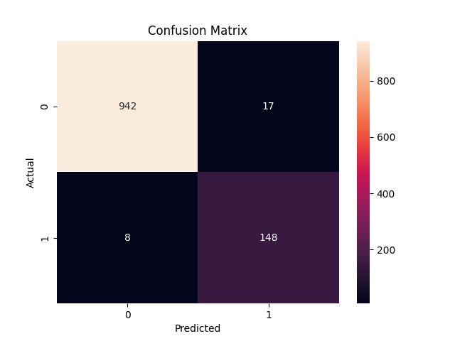

# 📩 Spam Email Classifier (Machine Learning Project)

## 🚀 Project Overview
This project is a machine learning-based spam classifier that predicts whether a message is spam or not using Natural Language Processing (NLP).

---

## 🛠️ Tech Stack
- Python
- Pandas
- Scikit-learn
- Matplotlib & Seaborn
- Streamlit

---

## 📊 Features
- Spam detection using Naive Bayes
- Accuracy evaluation
- Confusion matrix visualization
- Interactive web app using Streamlit

---

## 📷 Screenshots
### App Interface


### Confusion Matrix


---

## ⚙️ How to Run

### 1. Clone repository
```bash
git clone https://github.com/itzjuliannn18-droid/spam-classifier.git
cd spam-classifier